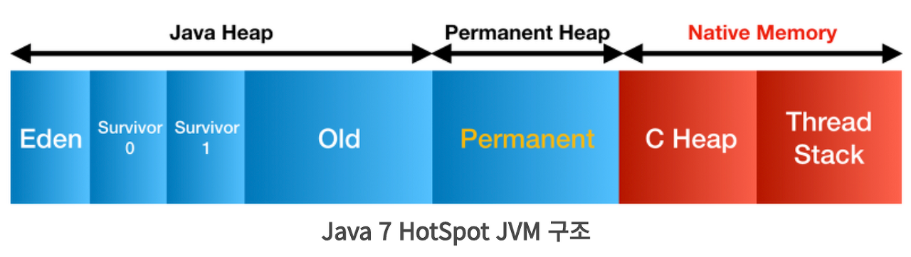
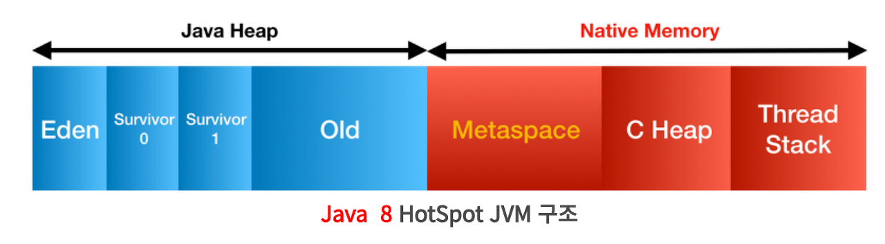

# 1. JVM 은 무엇이며 자바 코드는 어떻게 실행되는 것인가?
### 목표
자바 소스파일(.java)을 JVM 으로 실행하는 과정 이해하기.

### 학습할 것
- JVM 이란 무엇인가
- JVM 구성 요소
- 컴파일 하는 방법
- 바이트 코드란 무엇인가
- JIT 컴파일러란 무엇이며 어떻게 동작하는가
- JDK 와 JRE 차이
- javac 옵션 조사

## JVM 이란 무엇인가
개발자가 작성한 .java 파일을 실행시키려면 기계어로 번역하는 과정이 필요하다. 자바의 경우, 바로 기계어로 번역하지 않고, 
javac 라는 컴파일러로 바이트코드로 이루어진 .class 
파일을 생성한다. 실제 파일을 까보면, 바이트 단위의 명령어로 이루어져있다. 

한 줄로 정리하면 다음과 같다.

> 바이트 코드를 
> **_해석하고_**,
>
>메모리 영역에 클래스 정보를 **_저장하고_**
>
>**_실행하는_**
>
>자체 명령어 세트가 있는 추상 컴퓨팅 머신이다.
>
> (런타임에 다양한 메모리 영역을 조작한다)


(🤔굳이 중간단계를 거치는 이유? 플랫폼에 종속되기 싫어서? 근데 JVM 은 운영체제별로 따로 깔아야 되잖아... 이거 자체가 이미 종속된거 아녀? ㅋㅋ..?)

## JVM 구성 요소
Components of the JVM are:
### 1. 클래스 로더
   - JVM 의 initial 작업에는 바이트 코드 `loading`, `vefifying`, `linking` 이 있다. 클래스 로더는 이러한 작업을 담당한다.

### 2. 런타임 데이터 영역
JVM 은 자바 프로그램을 실행하기 위한 다양한 메모리 영역을 정의해놓았다. "실행"이니 당연히 런타임 동안 사용되며,
런타임시 사용되는 영역들을 "런타임 데이터 영역" 이라고 이름 붙였다.

이러한 영역 중 일부는 JVM 시작 시 생성되고, JVM 이 종료될 때 소멸될 수도 있으며, 일부는 스레드가 생성될 때 생성되고 스레드가 종료될 때 소멸된다.

구체적인 영역들에 대해 알아보자.

#### (1) Method Area
기본적으로 method 영역은 컴파일된 코드의 저장 영역과 비슷하다. 런타임 상수 풀, 필드 및 메서드 데이터, 메서드 및 생성자용 코드 같은 구조(structure)를 저장한다.
JVM 은 모든 클래스에 대해 이러한 구조를 저장한다.

Permanent Generation, PermGen 이라는 클래스 메타 데이터를 넣는 공간으로 불리기도 했다. 모든 JVM 스레드는 이 메모리 영역을 공유했었다.
> 클래스 메타데이터?
> 
>클래스의 이름, 생성정보, 필드정보, 메서드 정보 등. 자바에서는 클래스의 메타데이터를 읽고 해당
> 메타데이터를 통해 객체를 생성할 수 있다.

햐지만 이 PermGen 공간의 경우 클래스 로딩을 많이 하다보면 아래와 같은 에러가 종종 발생했기에, JDK 1.8 이후 버전부터는
PermGen 이 사라지고, Metaspace 영역으로 대체되었다.


PermGen 영역은 OS, JVM 버전마다 다른 디폴트 값을 가지고 있으며, 대부분 매우 작게 할당되어있었음.

```
java.lang.OutOfMemoryError: PermGen space
```

PerGen 을 대체한 Metaspace 영역은 클래스 메타 데이터를 native 메모리에 저장하고, 부족할 경우 자동으로 늘려주게 된다.
이로 인해 더이상 PermSize 를 설정할 필요가 없어졌다.

#### (2) Heap Area
JVM 은 모든 클래스 인스턴스와 배열을 이 Heap 영역에 할당한다. 가비지 컬렉터는 이 Heap 영역의 메모리를 회수한다.
기본적으로 GC 에는 메모리 회수를 위한 세단계가 있는데, 두 개의 마이너 GC 와 하나의 메이저 GC 가 바로 그것!

힙 메모리는 또 세 부분으로 나눌 수 있다.
- `Eden Space`: Young Generation 공간의 일부이다. 객체를 생성할 때 JVM 은 이 공간에 메모리를 할당한다.
- `Survivor Space` : Young Generation 공간의 일부이기도 함. 이 생존자 공간은 GC 의 마이너 GC 단계에서 살아남은 기존 객체가 들어있다.
- `Tenured Space` : Old Generation 공간으로도 알려져 있음. 이름 그대로 오래 살아남은 객체들을 보관하고 있다. 
Young Generation 객체에 설정된 임계값을 충족하면, 이 공간으로 이동한다.

JVM 은 시작하자마자 힙 영역을 생성한다. **JVM 의 모든 스레드는 이 영역을 공유한다.**

#### (3) Stack Area
프레임 단위로 데이터를 저장하며, 각 프레임에는 지역변수와 메서드 호출을 저장한다. **JVM 은 새 스레드를 생성할 때마다 스택 영역을 생성한다.**
각 스레드에 대해 각 스택 영역은 서로 비공개이다.

스택의 각 항목을 Stack Frame 또는 Activation record 라고 부르며, 각 프레임은 세 부분으로 이루어져있다.
# 🤔 ?
- 지역변수 : 메소드의 모든 지역변수와 매개변수
- 피연산자 스택 : 중간 계산 결과를 저장히기 위한 작업공간으로 사용
- 프레임 데이터 : 부분 결과를 저장하는 데 사용. 메서드에 대한 반환값. 예외 발생시 해당 catch 블록 정보를 제공하는 예외 테이블에 대한 참조

#### (4) PC 레지스터
각 JVM 스레드에는 현재 실행중인 **명령어의 주소를 저장**하는 별도의 PC 레지스터가 있다. 현재 실행중인 명령어가 네이티브 메서드 스택일 경우 이 값은 정의되지 않는다.

#### (5) 네이티브 메서드 스택
자바가 아닌 C 같은 기계 친화적 언어로 작성되어있다. JVM 은 이러한 네이티브 메서드를 호출하는 기능을 제공한다.
"C stacks"라고도 불림. 

### 3. 실행엔진
실행엔진은 메모리 영역에 있는 정보를 사용하여 명령을 실행한다. 세 부분으로 이루어져 있음.
#### (1) 인터프리터
클래스 로더가 바이트 코드를 `load` 하고 `verify` 하면 인터프리터는 바이트코드를 한줄씩 실행한다. 이 과정은 매우 느림.
인터프리터의 단점은, 하나의 메소드가 여러번 호출될 때마다 또 새롭게 interpret 해야 한다는 것이다.

그래서! JVM 은 이러한 단점을 보완하기 위해 JIT 컴파일러를 사용한다.

#### (2) Just-In-Time(JIT) 컴파일러
JIT 컴파일러는 런타임에 자주 호출되는 메서드의 바이트코드를 네이티브 코드로 컴파일한다. 따라서 자바 프로그램의 최적화를 담당함.
JVM 은 실행중인 메소드를 자동으로 모니터링한다. 메서드가 JIT 컴파일에 적합하게 되면, 머신 코드로 컴파일하도록 예약된다. 이 메서드가 hot method 🔥이다.

#### (3) 가비지 컬렉터
**힙 메모리**를 살펴보고, 사용중인 객체와 사용하지 않는 객체를 식별하고, 사용하지 않는 객체를 삭제한다.
GC 는 데몬 스레드이다. System.gc() 메서드를 사용해 명시적으로 호출할 수 있지만, 즉시 실행되지 않고 JVM 이 GC 를 호출할 시기를 결정.
### 4. 자바 네이티브 인터페이스
자바 코드와 네이티브 라이브러리(C/C++) 의 인터페이스.

### 5. 네이티브 라이브러리
각 플랫폼별 라이브러리이며, 네이티브 메서드의 구현을 포함한다.

## 컴파일하는 방법
1. Hi.java 파일 작성
2. 자바 컴파일러인 javac 로 .java 파일 바이트 코드로 변환(컴파일)
```
$ javac hi.java # 결과로 Hi.class 파일이 생성된다.
```
3. java 명령어로 Hi.class 파일 실행
```
$ java hi
```

## JRE 와 JDK
### JRE
Java Runtime Environment 는 자바 애플리케이션을 실행시키기 위핸 소프트웨어 컴포넌트 번들임.
핵심 컴포넌트는 다음과 같다.
- JVM 의 구현체
- 자바 프로그램을 실행시키기 위한 클래스들
- 설정 파일들

JVM 은 위에서 다뤘으니, 여기서는 핵심 클래스들과 설정 파일에 대해 알아보자,
(1) 부트스트랩 클래스들
jre/lib/ 에서 부트스트랩 클래스를 찾을 수 있다. 이 경로는 부트스트랩 경로라고도 한다. 아래와 같은 파일들을 포함.
- 런타임 클래스들 in _rt.jar_
- 국체화 클래스들 in _i18n.jar_
- 캐릭터 변환 클래스들 in _charsets.jar_
- 그외 등등..

부트스트랩 클래스 로더는 위의 클래스 파일들을 JVM 이 처음 뜰 때 로드한다.

(2) 확장 클래스들
자바 플랫폼에 대한 확장을 위한 확장 클래스를 jre/lib/extn/ 에서 찾을 수 있다. 이 경로는 확장 클래스 경로라고도 한다.
사용자는 이 디렉토리에 사용자 정의 jar 를 추가할 수 있다.

(3) 설정 파일
/jre/lib/ 내에 있음.
- 캘린더 설정을 위한 설정파일 _calendar.properties_
- 로그 설정을 위한 설정파일 _logging.properties_
- 네트워크 설정을 위한 설정파일 _net.properties_
- 등등...

(4) 그외 다른 파일들
- 보안 관리를 위해. _jre/lib/security_
- 폰트 _jre/lib/fonts_

### JDK
자바 애플리케이션을 개발하고, 컴파일하고 디버깅하고 실행하는데 필요한 도구들과 환경을 제공하는 키트임.

Core components of JDK:
- JRE
- Development Tools

JRE 는 위에서 다뤘으므로, 여기서는 Development Tools 에 대해 알아보겠음
이러한 도구는 JDK 의 기반이 되며, 자바 애플리케이션을 만들고 빌드하는데 사용된다. 컴파일, 디버깅, 자바독 생성을 위한 유틸리티가 있음

- `javac`
- `java`
- `javadoc`
- `jar`
- `javap`
- 등등..


참조
https://www.baeldung.com/jvm-vs-jre-vs-jdk


