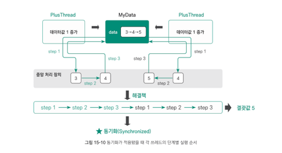

## 목표

자바의 멀티스레드 프로그래밍에 대해 학습한다

## 학습할 것

- Thread 클래스와 Runnable 인터페이스
- 쓰레드의 상태
- 쓰레드의 우선순위
- Main 쓰레드
- 동기화
- 데드락

> 프로그램이 실행되기 위해서는,
> - 프로그램을 메모리에 로딩하여 프로세스 상태로 만든다
> - 로딩된 메모리의 프로세스가 CPU 와 비슷한 속도로 대화하면서 프로그램을 실행

### Process 란?

- 실행중인 프로그램
- 메모리, 데이터 등의 자원과 스레드로 구성됨

### Thread 란?

- 프로세스 내에서 실제로 작업을 수행하는 주체
- 두 개 이상의 쓰레드를 가지는 프로세스를 멀티 스레드 프로세스라고 한다
- 경량 프로세스라고 불리며 가장 작은 실행단위이다
- CPU 를 사용하는 최소 단위

CPU 는 속도 차이의 문제로 메모리의 프로세스와만 대화한다. 즉 프로세스만 CPU 를 사용할 수 있는 것이다.
하지만, **실제 CPU 를 사용하는 것**은 프로세스 내부의 **_스레드_**이다. 프로세스가 스레드를 갖고 있으므로 외부에서 보면 프로세스가
CPU 를 사용하는 것처럼 보였던 것일 뿐.

#### 자바 프로그램에서의 스레드

자바로 작성한 프로그램을 실행하면 메모리로 로딩돼 프로세스 상태가 된다.

.class 파일을 실행하면 자바 가상머신은 main 스레드를 생성한다. 즉 프로그램이 처음 실행되면 main 스레드 1개만이 존재하는 것이다.
main() 메서드에서 작성한 내용이 바로 이 main 스레드에서 동작한다. 만일 main 스레드 내부에서 두개의 스레드를 실행하면 동시에 3개의 스레드가 동작하게 되는데, 이를
멀티스레드 프로세스라고 한다.

#### 동시성과 병렬성

**동시성**<br/>
처리할 작업의 수가 CPU 의 코어수보다 많을 때다. 예를들어 CPU 의 코어는 1개인데, 동시에 처리해야할 작업이 2개일 때 CPU 는 이에 대한 요청 작업을 **번갈아가면서 실행한다**.
매우 짧은 간격으로 교차실행하기 때문에 사용자는 마치 동시에 실행되는 것처럼 느끼게 되는데, 이것이 바로 스레드의 동시성이다.

동시성은 엄밀히 이야기핮하면, 두 작업이 동시에 실행되는 것이 아니라 **동시에 실행되는 것처럼 보이도록 하는 방식**이다.

**병렬성**<br/>
만일 CPU 의 코어수가 작업수보다 많을때, 이때는 **각각의 작업을 각각의 코어에 할당해 동시에 실행**할 수 있기 때문에 그야말로 동시에 작업이 수행된다.
이를 **스레드의 병렬성**이라 한다.

예를 들어 해야할 작업이 3개, CPU 코어 수가 4개라면 각각의 작업을 각각의 코에엇 실행하는 스레드 병렬성이 적용된다.

> 만일 작업수가 6개, 코어가 2개라면?

이때는 스레드의 동시성과 병렬성이 함께 적용된다. 먼저 작업이 2개의 코어에 나뉘어 할당되고(병렬성), 각각의 코어는 할당된 작업을 번갈아 실행할 것이다(동시성)

정리하면, 멀티스레드의 목적은 병렬성과 동시성을 활용해 여러 작업을 동시에 실행하거나 동시에 실행되는 것처럼 보이게 하는 것이다.

#### 스레드의 속성

1. 현재 스레드 객체 참조값 얻어오기

```java
Thread.currentThread();
```

2. 실행중인 스레드의 개수 가져오기

```java
Thread.activeCount();
```

프로그램 실행 시 최초로 생성되는 main 스레드는 main 스레드 그룹에 속하며, main 스레드에서 생성한 스레드는 모두 같은 main 스레드 그룹에 속한.

3. 스레드에 이름 부여

```java
String setName(String name);

// 스레드 이름 가져오기
        String getName();
```

```java
package com.example.playground.thread;

class SubtitleThread extends Thread {
    @Override
    public void run() {
        System.out.println("현재 스레드: " + Thread.currentThread().getName());
        // 자막 번호: 하나~다섯
        String[] strArray = {"하나", "둘", "셋", "넷", "다섯"};

        // 자막 번호 출력
        for (int i = 0; i < strArray.length; i++) {
            System.out.println("(자막 프레임)" + strArray[i]);

            try {
                Thread.sleep(500);
            } catch (InterruptedException e) {
                throw new RuntimeException(e);
            }

        }

    }
}

public class NeedForThread {
    public static void main(String[] args) {
        System.out.println("현재 스레드: " + Thread.currentThread().getName());
        System.out.println("현재 스레드 개수" + Thread.activeCount()); // 1
        Thread subtitleThread = new SubtitleThread();
        subtitleThread.start();
        System.out.println("현재 스레드 개수" + Thread.activeCount()); // 2


        // 비디오 프레임: 1~5
        int[] intArray = {1, 2, 3, 4, 5};

        // 비디오 프레임 출력
        for (int i = 0; i < intArray.length; i++) {
            System.out.println("(비디오 프레임)" + intArray[i]);

            try {
                Thread.sleep(500);
            } catch (InterruptedException e) {
                throw new RuntimeException(e);
            }
        }


    }
}

```

#### 스레드의 우선 순위

모든 스레드는 1~10 사이의 우선순위를 갖고 있다. 1이 가장 낮으며, 10이 가장 높은 순위 값이다. 우선순위를 지정하지 않으면 기본적으로 5의 우선순위를 갖는다.
보통 우선순위를 높게 설정한 스레드가 먼저 실행되지만, 그렇지 않을 수도 있다. 스레드는 실제로 실행되기 전에 일정 시간의 준비 과정(메모리 할당 등)이 푤요하기 때문이다.

#### 스레드의 데몬 설정

일반적으로 스레드 객체를 실행하면 다른 스레드의 종료 여부와 관계없이 자신의 스레드가 종료될때까지 게속 실행된다. 하지만, 문서 편집 프로그램에 일정 시간 간격으로 자동 저장을 수행하는
스레드가 있다고 해보자. 문서 편집 프로그램 자체가 종료되면 자동 저장 스레드는 더이상 동작할 필요가 없다. 이렇게 다른 스렏, 정확히는 일반 스레드가 모두 종료되면 함께 종료되는 스레드를 데몬 스레드라고 한다.

스레드의 데몬 설정은 Thread 의 인스턴스 메서드인 setDemon() 메서드를 이용하면 된다.

```java
void setDemon(boolean on)
```

**주의** 🚨
대부분 데몬 스레드는 자신을 호출한 주 스레드가 종료되면 함께 종료된다고 이해한다. 하지만 데몬 스레드는 주 스레드가 아니라 **_프로세스 내의 모든 일반 스레드가 종료돼야 종료_**된다.

### Thread 클래스와 Runnable 클래스

#### 스레드의 생성 및 실행

스레드를 생성하는 방법은 크게 2가지로 나뉠 수 있다.

**방법 1**Thread 클래스를 상속받아 run() 메서드 재정의

```java
class MyThread extends Thread {
    @Override
    public void run() {
        // 스레드 작업 내용
    }
}
```

**방법 2**Runnable 인터페이스 구현 객체 생성 후 Thread 생성자로 Runnable 객체 전달

```java
class MyRunnable implements Runnable {
    @Override
    public void run() {
        // 스레드 작업 내용
    }
}
```

### 스레드의 동기화

#### 동기화의 개념

동기화<sup>synchronized</sup> 란, 하나의 작업이 완전히 종료된 후 다른 작업을 수행하는 것을 말한다.
> 즉, 하나의 스레드가 객체를 사용한 후 다른 객체가 사용할 수 있도록 하는 설정

반대로 비동기 <sup>asynchronous</sup> 는 하나의 작업 명령 이후 완료 여부와 상관 없이 바로 다른 작업 명령을 수행하는 것을 말한다.

#### 동기화의 필요성
왜 멀티스레드를 사용할 때 동기화가 필요할까?


객체 내부의 data 필드에 3의 값을 저장하고 있는 MyData 객체가 1개 있다. 이 객체를 2개의 PlusThread 라는 스레드가 공유하고 있다.
즉 2개의 스레드가 동시에 MyData 객체 내의 데이터 값을 1씩 증가시키고자 할때다. 당연히 2개의 스레드가 각각 1씩 증가시켰으므로 data 필드값은 5가 되어야 하겠지만
결과는 그렇지 않을 수 있다.

두 스레드에서 각각 1씩 증가시키는 로직인데, 1밖에 증가되지 않게 되는 이유는 두번째 스레드가 값을 증가시키는 시점에 첫번째 스레드의 실행이 
끝나지 않아(data 필드에 값을 업데이트하는 작업) data 의 값이 여전히 3인 상태로 두번째 스레드를 실행하기 때문이다

의도하는대로 결과값이 5가 나오게 하려면 어떻게 해야할까?
가장 쉽게 생각할 수 있는 방법은 바로 **하나의 스레드가 완전히 종료된 후 다른 스레드를 실행하는 것이다**.



위처럼 하나의 스레도가 MyData 객체 내의 data 필드값을 완전히 증가시키고 난 후 다음 스레드가 동일한 작업을 수행한다면
data 필드값은 5의 결과를 가지게 될 것이다.

이렇게 한 스레드가 객체를 모두 사용해야 다음 스레드가 사용할 수 있도록 설정하는 것을 '동기화' 라고 한다.


#### 동기화 방법
동기화 방법은 **메서드 동기화** 와 **블럭 동기화** 로 나눌 수 있다.

메서드 동기화는 2개의 스레드가 동시에 메서드를 실행할 수 없다는 것, 블록 동기화는 2개의 스레드가 동시에 해당 블록을 실행할 수 
없다는 것을 의미한다. 즉 하나의 스레드가 메서드 또는 블록 사용을 완전히 종료한 후 잠금이 풀리면 다른 스레드가 사용할 수 있는 것이다.

1) **메서드 동기화**

메서드를 동기화할 때는 동기화하고자 하는 메서드의 리턴 타입 앞에 synchronized 키워드를 넣으면 된다.
```java
class MyData {
    int data = 3;
    public synchronized void plusData() {
        // data 필드의 값을 +1 수행
    }
}
```
이렇게 메서드에 동기화 설정을 해주면, 하나의 스레드가 이 메서드를 완전히 종료한 후에만 다른 스레드가 이 메서드를 실행할 수 있기 때문에
결과로 4가 나왔던 문제를 해결할 수 있다.

2) **블럭 동기화**

비록 멀티스레드를 사용하는 프로그램이라하더라도 동기화 영역에서는 하나의 스레드만 실행할 수 있기 때문에
성능면에서는 손해이다. 만일 메서드 전체중에 동기화가 필요한 부분이 일부라면 굳이 전체 메서드만 동기화할 필요없이
해당 부분만 동기화할 수 있는데, 그것이 바로 블록 동기화이다.


