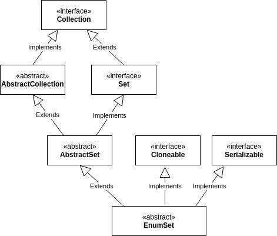

### 학습할 것
- enum 정의하는 법
- enum 이 제공하는 메소드 (values() 와 valueOf())
- java.lang.Enum
- EnumSet

## enum 정의하는 법
1. 일반적인 생성 방법
```java
public enum 열거형이름 {상수명1, 상수명2, ...}
```
```java
public enum Operation {
    ADDITION, SUBTRACTION, MULTIPLICATION, DIVIDE
}
```
괄호 `{}` 안에 상수의 이름을 나열하면 된다.

2. 값을 가진 enum 상수
```java
enum 열거형이름 {
    상수명(), // 생성자 호출
    상수명(), // 생성자 호출
    상수명()  // 생성자 호출
    
    private final [데이터타입] [변수이름];
    
    public get변수이름(){
        return 변수이름;
    }
    private 생성자(매개변수..) {
        변수 = 값;
    }
}
```
```java
enum DisplayType {
    CRT("Cathode Ray Tube"),
    FPD("Flat Panel Display"),
    LED("Light emitting diode"),
    OLED("Orginic Light Emitting Diode");
    
    private final String key;

    public String getKey() {
        return key;
    }
    DisplayType(String key) {
        this.key = key;
    }
}
public class EnumTest {
    public static void main(String[] args) {
        System.out.println(DisplayType.LED); // LED
    }
}

```
## enum 이 제공하는 메소드 (values() 와 valueOf())

```java
enum Parts {
    SKIN, MUSCLES, BONES, TISSUE
}

public class EnumExample {
    public static void main(String[] args) {
        for (Parts part : Parts.values()) {
            int i = part.ordinal();
            System.out.println(i + " " + part); // 1 SKIN
        }
        Parts skin = Parts.valueOf("SKIN"); // SKIN

    }
}
```
## java.lang.Enum
`Enum` 클래스는 모든 열거형이 공통으로 상속받는 추상 클래스다.
우리가 선언하는 enum 타입은 이 Enum 클래스를 자동으로 상속하기때문에 Enum 에서 제공하는
ordinal 과 같은 변수, 메서드를 사용할 수 있는 것이다.
```java
package java.lang;

import java.io.Serializable;
import java.io.IOException;
import java.io.InvalidObjectException;
import java.io.ObjectInputStream;
import java.io.ObjectStreamException;

public abstract class Enum<E extends Enum<E>> implements Comparable<E>, Serializable {

    private final String name;

    public final String name() { return name; }

    private final int ordinal;

    public final int ordinal() { return ordinal; }

    protected Enum(String name, int ordinal) {
        this.name = name;
        this.ordinal = ordinal;
    }

    public String toString() { return name; }
    ...
```

## enum 싱글톤
- 싱글톤의 특징을 가진다
- 리플렉션을 통해 싱글톤을 깨뜨릴 수도 없다

## EnumSet
> 열거형 타입과 함께 사용하기 위한 특별한 Set 구현체


```java
import java.util.EnumSet;

enum Color {
    RED, YELLOW, GREEN, BLUE, BLACK
}

public class EnumSetTest {
    public static void main(String[] args) {
        EnumSet<Color> colors = EnumSet.allOf(Color.class);
        colors.forEach(System.out::println);
        
    }
}

```
### EnumSet 사용의 장점
- EnumSet 의 모든 메서드는 산술비트 연산을 사용하여 구현되므로 일반적인 연산이 매우 빠름

