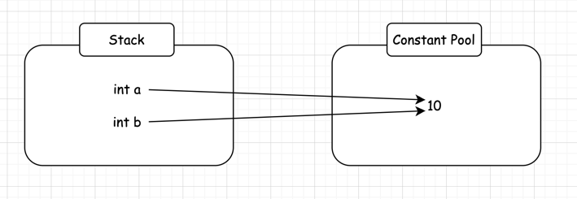

# 2. 자바 데이터 타입, 변수 그리고 배열
### 목표
자바의 프리미티브 타입, 변수 그리고 배열을 사용하는 방법을 익힌다.

### 학습할 것
- 프리미티브 타입 종류와 값의 범위 그리고 기본값
- 프리미티브 타입과 레퍼런스 타입
- 리터럴
- 변수 선언 및 초기화 방법
- 변수의 스코프와 라이프타임
- 타입 변환, 캐스팅 그리고 타입 프로모션
- 1차 및 2차 배열 선언하기
- 타입 추론, var

## 프리미티브 타입

> 자바에는 8가지 기본(원시) 데이터 유형이 있다. 
> 
> int, byte, short, long, float, double, boolean 그리고 char.

- boolean - 1비트
- byte - 8비트
- short - 16비트
- int, float - 32비트
- long, double - 64비트

이건 JVM 구현에 따라 다를 수 있음. 예를 들어 Oracle VM 에서 부울 유형은 int 값 0과 1에 매핑되기 때문에 32 비트가 필요.

이러한 원시 데이터 변수는 스택에 있으므로 빠르게 엑세스 가능하다.

## 참조 타입
참조 유형은 객체. 힙에 상주하며 상대적으로 액세스 속도가 느리다. 


## 리터럴
리터럴이란 변하지 않는 데이터 그 자체를 의미한다.
```java
int a = 10; // 10 과 같이 변하지 않는 고정적인 값을 리터럴이라 한다
int b = 10;
```
변수 a와 b는 모두 10이라는 값을 가지고 있다. 위 코드를  실행시키면 자바 내부에서는 무슨 일이 일어날까?

일단 10이라는 값을 Constant Pool 이라는 메모리 영역에 할당한다. 자바는 똑같은 값을 또 호출했을 때, 전에 할당했던 메모리 주소값을 넘겨주게 된다.

a == b 가 true 가 나오는 이유도, a 와 b 가 똑같은 메모리 주소를 가리키고 있기 때문이다. (**== 은 메모리 주소를 비교**)

## 타입 캐스팅
### 업캐스팅과 다운캐스팅 
#### 업캐스팅
서브클래스 -> 슈퍼클래스로 캐스팅하는 것. 일반적으로 컴파일러에서 암시적으로 수행됨.
**업캐스팅 덕분에 다형성을 활용할 수 있음**

#### 다운캐스팅
```java
Animal animal = new Cat(); // Animal 변수가 Cat 인스턴스를 참조하고 있다. 여기서 `animal.meow()` 메서드를 호출하고 싶지만, 컴파일 에러가 나게 될 것.
((Cat) animal).meow(); // meow() 를 호출하기 위해 Animal 을 Cat 으로 다운캐스팅 함
```

## 타입 추론, var
```java
String message1 = "안녕 자바 9";
var message2 = "안녕 자바 10"; // 가능
```

참조

https://www.baeldung.com/java-primitives

https://www.baeldung.com/java-primitives-vs-objects

https://www.baeldung.com/java-type-casting


