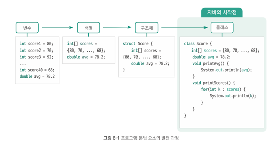
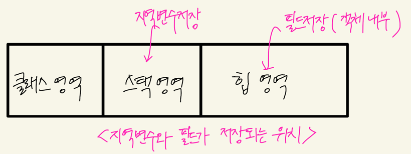
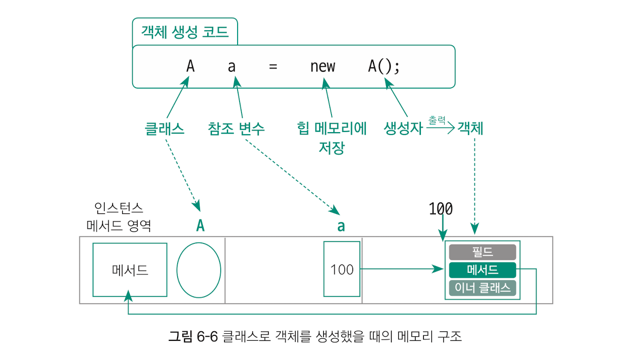

### 목표
자바의 class 에 대해 학습한다.
### 학습할 것
- 클래스 정의하는 방법
- 객체 만드는 방법(new 키워드 이해하기)
- 메소드 정의하는 방법
- 생성자 정의하는 방법
- this 키워드 이해하기

> 그전에, 클래스의 탄생 배경에 대해 알아보자.


클래스는 다양한 자료형의 데이터를 묶어 관리할 수 있을 뿐만 아니라, 데이터를 처리하는 
다양한 기능까지 함께 관리하는 문법 요소이다. 클래스에 포함돼 클래스 안에 있는 데이터를 처리하는 기능을 메서드라고 한다.
클래스 구조는 `데이터`와 데이터를 처리하는 `기능` 을 함께 묶음으로써, 데이터를 처리하는 다양한 기능까지 함께 관리할 수 있다.

## 클래스를 정의하는 방법
```java
class 클래스명 {
    ...
}
```
클래스의 정의는 위와 같다.</br>
이번에는 A 라는 이름의 클래스를 포함하는 자바 소스 파일 A.java 의 구조를 살펴보자.

```java
package ...; // 1. 패키지
import ...; // 2. 임포트
class 클래스명 { ... } // 3. 외부 클래스

// 위 세 항목은 클래스의 밖에 올 수 있는 것이다.

// 아래 네 항목은 클래스 안에 올 수 있는 것이다.

public class A { // 1. 파일명과 동일해야 한다
    int a = 3; // 2. 필드
    double abc() {...} // 3. 메서드
    A() { ... } // 4. 생성자
    class 클래스명 { ... } // 5. 이너클래스
}
```
### 클래스의 내부 구성요소
1. 필드
필드는 '클래스에 포함된 변수'로, 객체의 속성값을 지정할 수 있다. 필드는 지역변수(local variable)와 비교해야 하는데, 지역변수는 '메서드에 포함된 변수'를 말한다.
쉽게 말해, 필드와 지역변수는 어떤 중괄호 안에 선언되었는지에 따라 구분할 수 있는데, 클래스의 중괄호 안에 선언되어있다면 필드이고, 메서드의 중괄호 안에 선언된 변
수를 '지역변수 라고 생각하면 된다.

필드와 지역변수의 가장 큰 차이점은 생성되는 메모리의 위치이다. 필드는 힙메모리의 객체 내부,
지역변수는 스택 메모리에 생성된다. 


스택메모리의 변수는 자신이 선언된 중괄호가 닫혀 메서드가 종료되면, 그 메서드 안에 선언된 모든
지역변수가 메모리에서 통째로 삭제된다. 1개의 메서드 안에 선언된 모든 지역 변수들의 집합을 프레임이라한다.
힙메모리의 객체 안의 필드는 객체가 사라지지 않는 한 절대로 삭제 되지 않는데, 객체가 더이상 사용되지 않을 때, 즉 어떤 참조 변수도 해당 객체를 가리키지 않을 때
가비지컬렉터가 객체 자체를 제거한다.
## 객체 만드는 방법
```java
// 클래스명 참조변수명 = new 생성자();
// 참조변수는 실제 데이터를 저장하는 것이 아니라 실제 데이터가 있는 힙메모리의 위치값을 저장
A a = new A();
// new 키워드는 "~를 힙메모리에 넣어라" 라는 뜻으로도 해석될 수 있음.
// A() 생성자로 만든 객체를 힙 메모리에 넣고, 위치값을 A 타입의 참조 변수 a 에 저장하라!
```
클래스는 직접 사용할 수 없다. 클래스의 모든 데이터(필드)와 기능(메서드)들을 사용하려면
클래스를 이용해 객체를 만든 후 그 객체를 통해 필드와 메서드 등을 사용할 수 있다.

클래스에서 객체를 만드는 일은 생성자가 수행한다. 클래스의 생성자로 객체를 만드는 과정을
인스턴스화라고 하며, 그 결과물을 인스턴스라 한다.

인스턴스(객체) 속에는 클래스 내부 구성요소 중 생성자를 제외한 나머지 요소가 포함되어있는데, 이를 인스턴스 멤버라한다.

### 객체 생성에 따른 메모리 구조

클래스 A 는 메모리의 클래스영역, 참조 변수는 스택영역에 들어간다. 생성자로 만들어진 객체는 힙메모리에 위치하며,
객체 내부에는 클래스의 멤버(필드, 메서드, 이너클래스)가 위치한다. 

메서드 영역을 살펴보면, 실제 메서드 구현코드는 클래스 영역 안에 저장해 놓고, 힙메모리의 실제 객체 안에서는 메서드 영역의 위치만 기리키고 있는데,
이유는 동일한 클래스로 만든 모든 객체는 속성(필드)는 달라도 기능(메서드)는 동일하기 때문이다.

## this 키워드와 this 메서드
- 클래스 내부에서 자신의 객체를 가리키는 this 키워드
- 자신의 다른 생성자를 호출하는 this() 메서드
  - this() 메서드는 반드시 아래 두가지 문법 규칙을 지켜야 한다
    1. 생성자의 내부에서만 사용할 수 있다
    2. 생성자의 첫 줄에 위치해야 한다


