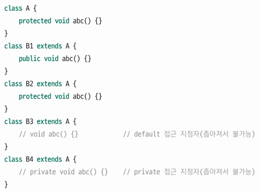

## 목표
자바의 상속에 대해 학습한다
## 학습할 것
- 자바 상속의 특징
- super 키워드
- 메소드 오버라이딩
- 다이나믹 메소드 디스패치 (다형성)
- 추상 클래스
- final 키워드
- Object 클래스

## 자바 상속의 특징
JVM 은 자식 클래스의 객체를 생성할 때 가장 먼저 부모 클래스의 객체를 생성한다. 이후 자식 클래스에서 추가한 힐드와 메서드가 객체에 추가됨으로써
자식 클래스의 전체 객체가 완성되는 것이다. 자식 클래스 객체 내부에 부모 클래스 객체가 포함되어 있으므로 자식 클래스 객체에서 부모 클래스의 멤버를 사용할 수 있는 것이다.

자바는 여러 클래스를 상속하는 다중상속을 허용하지 않는데, 모호성이 발생할 수 있기 때문에 금지해두었다.

상속구조에서 자기 자신을 가리키거나 화살표 방향으로는 항상 다형적인 표현을 할 수 있다.
> 상속의 범위

상속을 수행하면 부모의 모든 **_멤버_**를 내려받는다. 멤버는 클래스의 4가지 내부 구성요소중 생성자를 제외한 필드, 메서드, 이너클래스를 말한다.
생성자는 자식 클래스로 상속되지 않는데, 왜 그럴까?

```java
class B extends A {
    A() {} // 생성자로 볼 수도 없고, 반환타입이 없기에 메서드로 볼 수 없음. 
    // 따라서 부모 클래스로부터 생성자를 상속받는다면 상속과 동시에 오류 발생
}
```

### 객체의 타입 변환
업캐스팅이란 자식 클래스에서 부모클래스 쪽으로 변환되는 것이며, 그 반대가 다운캐스팅(부모 -> 자식)이다. 객체는 항상 업캐스팅할 수 있으므로 명시적으로 적어주지 않아도
컴파일러가 대신 넣어준다. 하지맘ㄴ 다운캐스팅은 개발자가 직접 명시적으로 넣어주어야 한다.

```java
class A {}
class B extends A {}
class C extends B {}

B b1 = new B();
A a1 = _(A)_ b1;  // 컴파일러가 자동으로 추가

C c1 = new C();
A a2 = (A) c1; // 컴파일러가 자동으로 추가
B b2 = (B) c1; // 컴파일러가 자동으로 추가
```

다운캐스팅의 경우, 어떤 생성자를 통해 객체가 만들어졌느냐에 따라 가능 여부가 달라진다. 다운캐스팅을 할 수 있기 위해서는 힙메모리 내에 해당 객체가 있어야 한다.
캐스팅할 수 있는지를 확인하려면 실제 객체를 어떤 생성자로 만들었는지를 알아야 한다. 이럴 때, instanceof 키워드를 사용하면 상속 관계나 객체를 마든 생성자를
직접 확인하지 않고도 캐스팅 가능 여부를 확인할 수 있다. 따라서 혹시모를 ClassCastException 으로 프로그램이 죽을 것을 방지하기 위해 일반적으로
다운캐스팅을 수행할 때는 instanceof 를 이용해 캐스팅 가능 여부를 확인하고, 가능할 때만 캐스팅을 수행한다.

## 메소드 오버라이딩
부모의 메서드를 자신이 만든 메서드로 덮어쓰는 개념. 

### 메소드 오버라이딩과 접근제어자
자식 클래스가 부모 클래스의 메서드를 오버라이딩할 때는 반드시 상속 받은 메서드의 접근제어자와 범위가 같거나 넓은 접근 지정자를 사용해야 한다.
즉 접근 제어자의 범위를 좁힐 수 없다. 


`protected` : 다른 패키지에서 사용 불가. 상속 관계인 경우 예외적으로 다른 패키지에서 사용가능 </br>
`default` : 다른 패키지에서 사용 불가.

## super 키워드와 super() 메서드
> this 키워드와 this() 메서드

this 키워드와 this 메서드는 클래스 자신의 내부 구성 요소를 호출하는 문법 요소이다.
this 는 자기 객체를 가리키는 참조변수명으로, 인스턴스 메서드 내부에서 필드를 사용하거나 메서드를 호출할 때 참조변수명으로 사용되며,
생략했을 때 컴파일러가 자동으로 추가해준다. 

this() 메서드는 자신의 또 다른 생성자를 호출하고, 생성자내에서만 사용할 수 있으며, 항상 첫 줄에 위치해야 한다.
**this 는 자신의 객체, this() 는 자신의 생성자를 의미**하는 것이다.

> super 키워드와 super() 메셔드

super 는 부모의 객체, super() 는 부모의 생성자를 의미힌다. **super 와 super() 모두 부모 클래스와 관련이 
있으므로 상속 관계에서만 사용할 수 있다.**

### 부모의 객체를 가리키는 super 키워드
super 키워드는 부모의 객체를 가리키는 것으로, 필드명의 중복 또는 메서드 오버라이딩으로 가려진 
부모의 필드 또는 메서드를 호출하기 위해 사용한다.

## Object 클래스
자바의 모든 클래스는 Object 클래스를 상속받는다. 실제로 컴파일러는 아무런 클래스도 상속하지 않으면 자동으로
`extends Obejct`를 삽입해 Object 클래스를 상속한다. 따라서 자바의 모든 클래스는 어떤 객체로 만들던지 Object 타입으로 선언할 수 있다.

Object 클래스는 자바의 최상위 부모 클래스로, 자바의 모든 클래스는 Object 클래스의 메서드를 포함하고 있다.

`.toString()` , `.equals(Object obj)` , `hashCode()`, `wait()` , `notify()` 등이 있다.

#### toString() - 객체 정보를 문자열로 출력
toString() 메서드는 객체 정보를 문자열로 리턴하는 메서드이다. 여기서 객체정보는 **패키지명.클래스명@해시코드** 로 나타난다.
해시코드는 객체가 저장된 위치와 관련된 값이다. System.out.println() 메서드는 객체를 출력하면 자동으로 객체 내의 toString() 메서드를 호출한다.
이 메서드는 자식 클래스에서 메서드를 오버라이딩해 사용하는 것이 일반적이다.

#### equals(Object obj) - 스택 메모리의 값 비교
입력 매개변수로 넘어온 객체와 자기 객체의 스택 메모리 변수값을 비교해 그 결과를 true 또는 false 로 반환하는 메서드이다.
기본 자료형이 아닌 객체의 스택 메모리 값을 비교하므로, 실제 데이터의 값이 아닌 실제 데이터의 위치(번지) 를 비교하는 것이다.
이 메서드는 == 연산자와 완벽하게 동일한 기능을 수행한다.
만일 실제 내용을 비교하고자 할 때는 equals() 메서드를 오버라이딩해 사용해야 한다.

#### hashCode() - 객체의 위치와 연관된 값
Object 의 hashCode() 메서드는 객체의 위치에 따른 고유값을 리턴한다. Hash*** 형태의 자료구조에서는 동등비교를 위해
hashCode() 결과값을 비교하므로, 필요할 때마다 equals() 메서드를 함께 추가로 오버라이딩해야한다.

## final 키워드
final 제어자는 필드, 지역변수, 메서드, 클래스 앞에 위치할 수 있으며 어디에 위치하느냐에 따라 의미가 다르다.

### final 변수
이벤트를 처리할 때 지역변수를 final 로 선언해야 하는 경우가 자주 있다. 스택메모리의 변수값은 자신이 만들어진 메서드가
종료되면 메모리에서 사라진다. 하지만 이벤트를 처리할 때 메모리에서 사라진 그 변수를 다시 사용해야할 떄가 있는데,
final 로 변수를 선언해놓으면 한번 생성하면 사라지지 않는 영역인 상수 영역에 복사 되어 변수를 사용할 수 있게 된다.

### final 메서드와 final 클래스
상속할 때 부모의 메서드를 오버라이딩하면 자식 클래스에서는 메서드의 기능이 변경된다. 하지만 메서드를 final 로 정의하면
자식 클래스에서 해당 메서드를 오버라이딩할 수 없게 된다.

이와 같은 개념으로 final 클래스 역시 최종 클래스의 의미로 더이상 자식 클래스가 없다는 것을 의미한다. 따라서 final 클래스는 상속 자체가 아예 불가능하다.

## abstract 키워드
메서드 앞에 abstract 키워드가 붙어있다면 이 메서드는 추상 메서드가 된다. 추상메서드는 '메서드의 본체가 완성되지 않은 미완성 메서드'를 말한다.
추상 메서드를 1개 이상 포함하고 있는 클래스는 반드시 추상 클래스로 정의돼야 한다.


