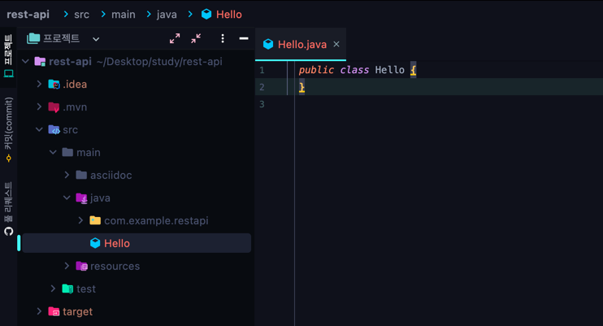
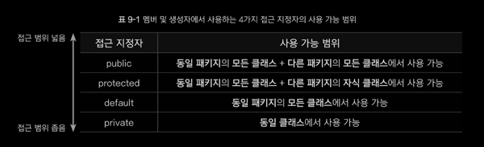
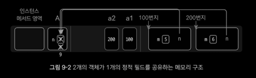

## 목표
자바의 패키지에 대해 학습한다

## 학습할 것
- package 키워드
- import 키워드
- 클래스패스
- CLASSPATH 환경변수
- -classpath 옵션
- 접근지시자

### package 키워드
패키지는 비슷한 목적으로 생성된 클래스 파일을 한곳에 모아둔 폴더를 의미한다.

/src/main/java 하위에 폴더를 생성하는 순간 패키지 경로가 생긴다. 그 폴더에 클래스를 생성하면 첫 줄에 반드시 패키지의 선언이 와야 한다.
```java
package exam1;

public class Test {
    public static void main(String[] args) {
        System.out.println("패키지~");
    }
}
```
단, 디폴트 패키지에 클래스 생성시에는 패키지 선언이 생략된다.

디폴트 패키지란, /src/main/java 를 의미한다.

### import 키워드

클래스의 풀네임은 **'패키지명.클래스명'** 이다. 자신이 속해있는 패키지의 클래스를 쓸 때는 
클래스이 이름만을 사용할 수 있지만, 다른 패키지의 클래스를 사용할때는 풀네임('패키지명.클래스명')을 명시해야 한다.

그러나 패키지명을 다 적은뒤 클래스를 사용하는 것은 가독성을 해치므로 `import`키워드를 사용한다.
실제 임포트되는 대상은 소스코드(.java)가 아니라 bin 폴더에 위치한 컴파일이 완료된 바이트코드(.class)이다.

### 접근 지정자
자바제어자 <sup>modifier</sup> 는 클래스, 필드, 메서드, 생성자에게 어떠한 특징을 부여하는 문법적 요소이다.

접근 지정자는 자바 제어자의 한 종류로, 클래스, 멤버, 생성자 앞에 위치할 수 있으며 사용 범위를 정의하는 역할을 한다.

#### 멤버 및 생성자의 접근 지정자

멤버 및 생성자에는 public, protected, default, private 이라는 4가지 종료의 접근 지정자를 사용할 수 있다.
아무것도 작성하지 않으면 default 접근 지정자가 자동으로 설정된다.

#### 클래스의 접근 지정자
클래스에서는 public, default 접근 지정자만 사용할 수 있다. 쉽게 말해 class 키워드 앞에 public 이 붙어있거나(public),
붙어있지않거나(default) 이다.

default 클래스는 같은 패키지 내에서만 사용할 수 있고, public 클래스는 다른 패키지에서도 사용할 수 있다.
클래스를 default 로 정의하면 달느 패키지에서 임포트가 불가능해 사용할 수 없게 된다.

#### 클래스 접근 지정자와 생성자 접근 지정자의 연관성
생성자를 정의하지 않았을 때,
클래스가 public 이면 자동으로 추가되는 생성자도 public 이며, 클래스가 default 이면 자동으로 추가되는 생성자도 default 이다.

### static 제어자
static 은 클래스의 멤버(필드, 메서드, 이너클래스)에 사용하는 제어자다. 클래스 내부의 변수 중,
static 이 붙어잇지 않은 변수를 인스턴스 멤버<sup>instance member</sup>라고 하며, static 이 붙어잇는 멤버를
정적 멤버<sup>static member</sup> 라고 한다.

정적 멤버의 가장 큰 특징은 객체의 생성없이 '클래스명.멤버명' 만으로 바로 사용할 수 있다는 것이다.

#### 인스턴스 필드와 정적 필드
```java
class A {
    int m = 3; // 객체를 생성한 후 사용가능
    static int n = 5; // 객체 생성 없이 사용 가능
}
```
인스턴스 필드와 정작 필드는 저장되는 공간의 위치가 다르다. 
인스턴스 필드를 사용하기 위해서는 먼저 객체를 생성한 후 '참조변수명.인스턴스필드명' 으로 사용해야 한다. 
인스턴스필드인 m 의 저장공간은 객체 내부에 생성되므로, m 을 사용하기 위해서는 반드시 객체를 먼저 생성해야 하며,
저장공간이 힙 메모리에 위치한다.

반면 정적필드 n 은 클래스 내부에 저장공간을 지니고 있기 때문에 객체 생성 없이 바로 사용 가능하다. n의 실제 저장 공간은 정적 영역
내부에 있다.

중요한 정적 필드의 특징은 바로, '**정적 필드는 객체 간 공유 변수의 성질이 있다**' 라는 것이다.


이와 같은 이유로 정적필드를 클래스별로 관리하는 클래스 변수라고도 한다.

#### 인스턴스 메서드와 정적 메서드
```java
class A {
    void abc() {
        System.out.println("인스턴스 메서드"); // 객체를 생성한 후에 사용가능
    }
    static void bcd() {
        System.out.println("static 메서드"); // 객체 생성 없이 사용 가능
    }
}
```

### CLASSPATH 환경변수
`환경변수`란, 실행파일이 모여있는 디렉토리 경로를 지정함으로써 어느위치에서든지 프로그램을 실행할 수 있도록 하는 것이다.

| 환경변수 | 설명 |
| --- | --- |
| Path | OS 에서 명령어를 실행할 때 명령어를 찾아야 하는 폴더의 우선순위를 설정하는 환경변수 |
| CLASSPATH | JVM 이 시작될 때,JVM의 클래스 로더는 이 환경변수를 호출한다. 그래서 환경 변수에 설정되어있는 디렉토리가 호출되면 그 디렉토리에 있는 클래스들을 먼저 JVM 에 로드한다. 그러므로 CLASSPATH 환경변수에는 필수 클래스들이 위치한 디렉토리를 등록하도록 한다 |
| JAVA_HOME | JDK 가 설치된 홈 디렉토리를 설정하기 위한 환경변수이다. 반드시 필요한 환경변수는 아니지만 Path 와 CLASSPATH 환경변수에 값을 설정할 때 JAVA_HOME 환경변수를 포함하여 설정한다 |

### -classpath 옵션
https://gispilot.tistory.com/5

`javac` 프록드램을 사용하려면 컴파일하려는 해당 클래스와 관련된 클래스 혹은 jar 파일의 경로를 설정해줘야 제대로 된 컴파일이 수행된다.
 > $ javac -cp c:₩classes;c:₩lib₩test.jar -d c:₩gogo TestJava.java

-cp (classpath) 는 참조하려는 **.class 파일이 위치한 경로**를 설정하는 옵션이다.

-d 는 .class 파일들이 생성될 위치를 설정하는 옵션이다.

결론적으로, 컴파일 하려는 클래스가 다른 클래스를 의존하고 있을 때, 컴파일 하기 위해서는 다른 클래스 파일의 위치를 알려주어야 한다.
이때 소스 파일을 알려주려면 -sourcepath 옵션을 사용하고, .class 파일의 위치를 알려주려면 -classpath 옵션을 사용해 알려주면 된다.


