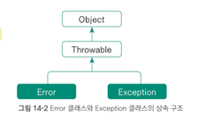

## 목표

자바의 예외 처리에 대해 학습한다

### 학습할 것

- 자바에서 예외처리 방법 (try, catch, throw, throws, finally)
- 자바가 제공하는 예외 계층 구조
- Exception 과 Error 의 차이는?
- RuntimeException 과 RE 가 아닌 것의 차이는?
- 커스텀한 예외를 만드는 방법

### 자바에서 예외처리 방법
### try-catch
예외처리를 위해서는 try-catch 구문을 이용하며, 그 구조는 아래와 같다.
```java
try {
    // 예외가 발생할 가능성이 있는 코드    
} catch (Exception1 e1) {
    // Exception1 이 발생했을 때, 처리 로직을 여기에 작성
} catch (Exception2 e2) {
    // Exception2 기 발생했을 때, 처리 로직을 여기에 작성
}
```
여러 개의 catch 블록을 넣을 수 있으며, 이 중 발생한 예외의 종류와 일치하는 단 한개의 catch 블럭만 수행된다.
#### throw
throw 키워드를 사용하여 `고의로 예외를 발생`시킬 수 있다.
#### throws
throws 는 메서드 선언부에 예외를 선언해둠으로써 해당 메서드를 사용하는 사람들이
어떤 예외를 처리해야하는지를 알려주는 역할을 한다. throws 로 예외가 선언된 메서드를
사용할 때 사용쟈가 각자 알아서 예외를 처리해줘야 한다. 즉 throws 는 해당 메서드에서 예외를 처리하지 않고,
**헤당 메서드를 사용하는 쪽이 예외를 처리하도록 책임을 전가** 하는 역할을 한다.
#### finally
예외의 발생 여부와 상관없이 항상 실행되어야할 로직을 위한 목적으로 사용된다.
```java
void myMethod() Exception1, Exception2, Exception3 {
    // 메서드 내용
}
```
### Exception 과 Error 의 차이점
```java
class Scratch {
    public static void main(String[] args) {
        try{
            int a = 1 / 0;
        } catch (ArithmeticException e){
            System.out.println(e.getMessage());
        }
    }
}
```
위 상황의 경우 1 / 0 연산으로 인해 오류가 발생한다. 이처럼 오류 발생시, 개발자가 차선책으로
처리 로직을 작성하는 것을 Exception 처리라고 한다.

반면, 차선택을 선택하는 것이 불가능한 경우를 Error 라고 한다.
대표적인 예로, 메모리가 꽉 찼을 때, 쓰레드가 죽었을 때를 들 수 있다.

### 자바가 제공하는 예외 게층 구조
자바에서 예외의 최상위 클래스는 Exception 클래스, 에러의 최상위 클래스는 Error 클래스이다.

두 클래스는 모두 Throwable 클래스를 상속하고 있으며, Throwable 클래스의 모든 기능을 쓸 수 있다.


RuntimeException 을 상속받지 않고 Exception 클래스를 상속받은 클래스들은 **일반예외** 로, 일반예외는 컴파일 전에
이 예외들은 예외처리를 하지 않으면 컴파일 에러가 발생한다.

반면 RuntimeException 클래스를 상속받은 **실행예외** 클래스들은
예외 처리를 따로 하지 않더라도 문법 오류가 발생하지 않는다.
다만 프로그램 실행시 프로그램이 강제종료되는 이유는 대부분 실행예외때문이므로, 주의가 필요하다.


### RuntimeException 과 RE 가 아닌 것의 차이는?
RuntimeException 클래스 상속 여부.
